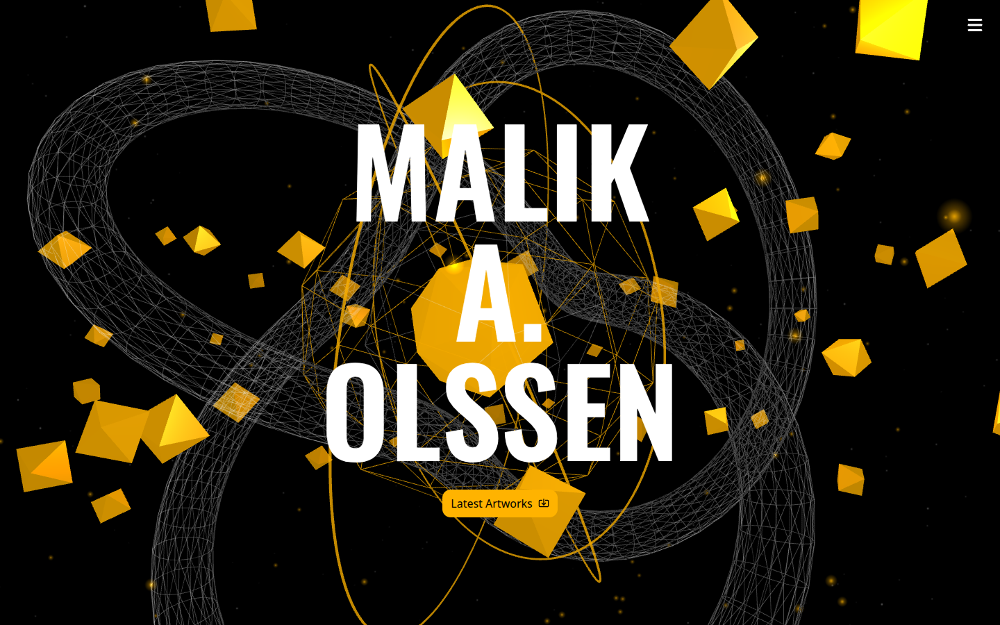
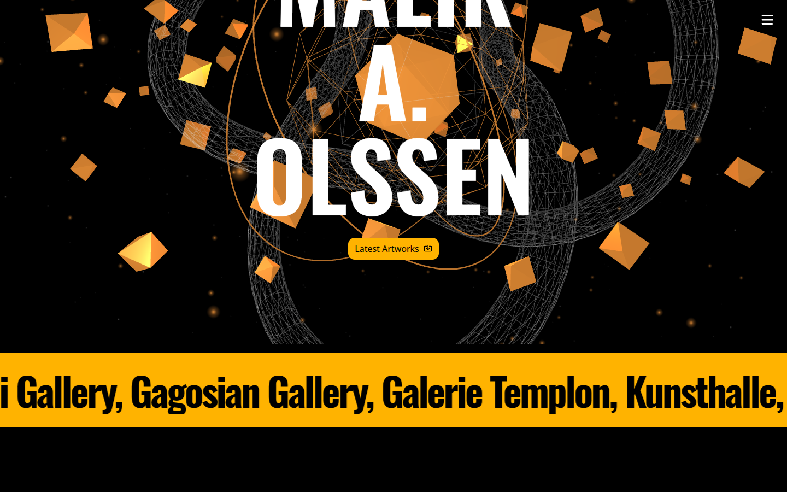
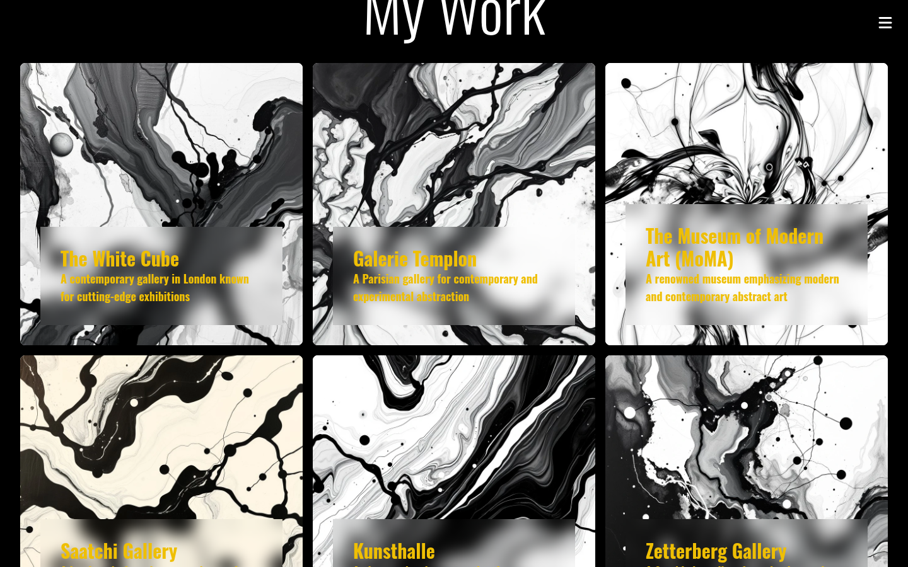
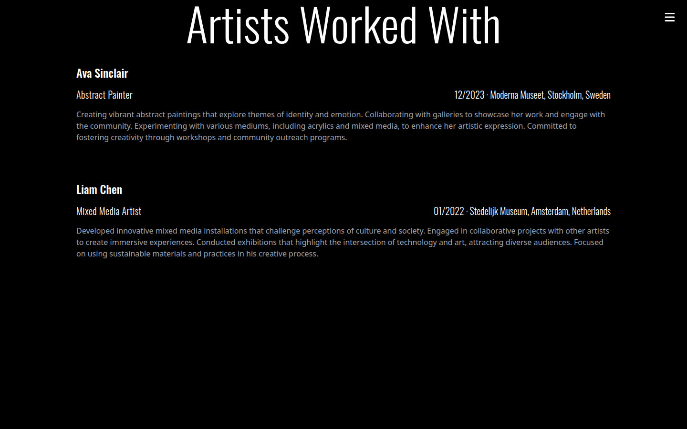
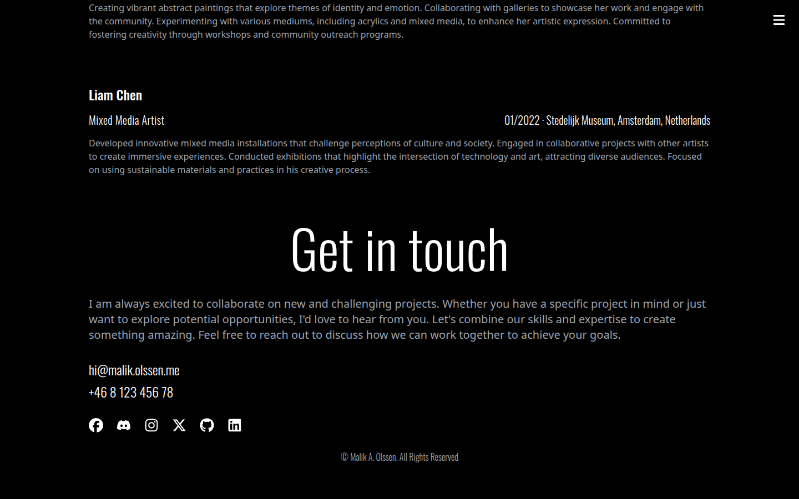
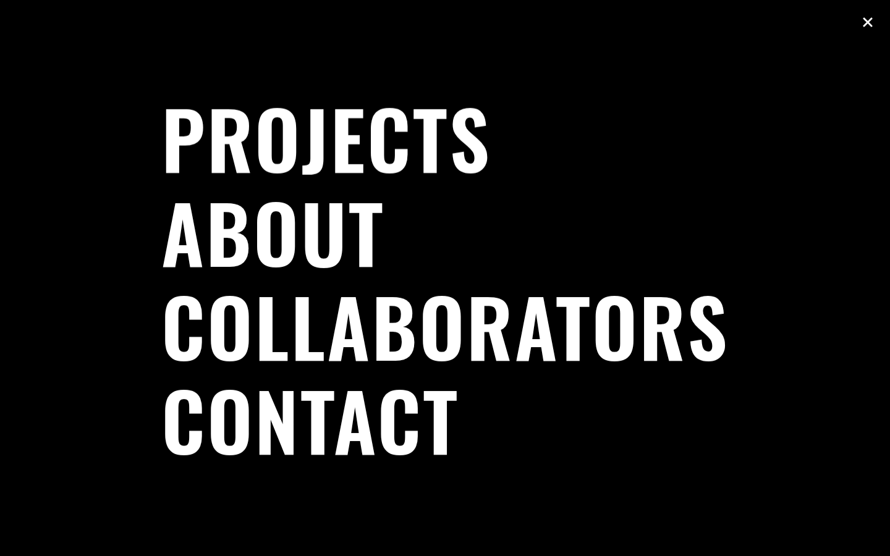
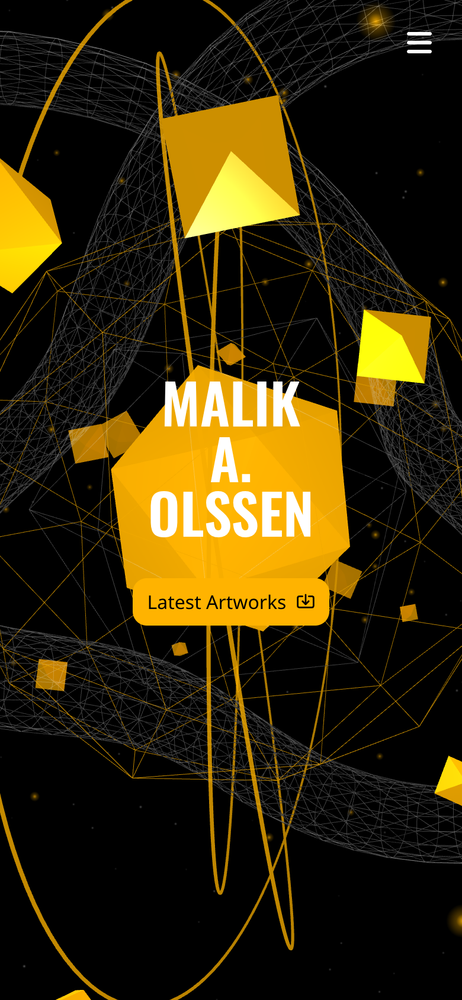

# The-Artist

An imaginary portfolio for Malik A. Olssen, a Stockholm-based abstract artist, built with React, Three.js and GSAP. It showcases abstract works and cultural influences through a dynamic, interactive design.

**Live site:** https://the-artist.vercel.app



## Features

### Three.js hero scene

A WebGL backdrop behind the name: a pulsing faceted core inside wireframe shells, gyroscope rings, a torus knot, orbiting shards, a starfield and amber dust. It tilts and lights up with the mouse, sends a shockwave on click, pulls back and drifts from amber to rose as you scroll, pauses when off screen and respects `prefers-reduced-motion`. It loads in its own lazy chunk.

| On load | While scrolling (amber drifts to rose) |
| --- | --- |
|  |  |

### Gallery

A masonry grid of works with batched GSAP card reveals and an image parallax inside each card. The looping gallery marquee above it runs on Framer Motion.



### About

The bio lights up word by word as you scroll, scrubbed by GSAP ScrollTrigger. Screen readers get the full paragraph.


### Collaborators and contact

Staggered scroll-in entrances for the collaborators list and the contact section.

| Collaborators | Contact |
| --- | --- |
|  |  |

### Menu and mobile

A full-screen animated menu (Framer Motion) that closes with Escape, and a layout that holds up on phones.

| Menu | Mobile |
| --- | --- |
|  |  |

## Stack

| Tool | Version | Used for |
| --- | --- | --- |
| [React](https://react.dev) | 18.3 | UI components |
| [Vite](https://vitejs.dev) | 5.4 | Dev server and production build (SWC plugin) |
| [Three.js](https://threejs.org) | 0.186 | The WebGL hero scene |
| [GSAP](https://gsap.com) + ScrollTrigger | 3.15 | Name reveal, scroll animations, hero mouse and scroll effects |
| [Framer Motion](https://motion.dev) | 11.11 | Marquee and menu animations |
| [Tailwind CSS](https://tailwindcss.com) | 3.4 | Styling and responsive layout |
| [React Icons](https://react-icons.github.io/react-icons) | 5.3 | Menu and social icons |
| ESLint | 9 | Linting |

Hosted on [Vercel](https://vercel.com).

## Getting started

```bash
cd firstproject
npm install
npm run dev      # start the dev server
npm run build    # production build
npm run lint     # eslint
```

## Structure

```
firstproject/src
├── components/   Navbar, Hero, HeroScene (Three.js), Marquee, Projects, About, Work, Contact
├── constants/    all site content (links, projects, bio, collaborators, contact)
└── assets/       artwork images
```

Edit `src/constants/index.jsx` to change the site content.
